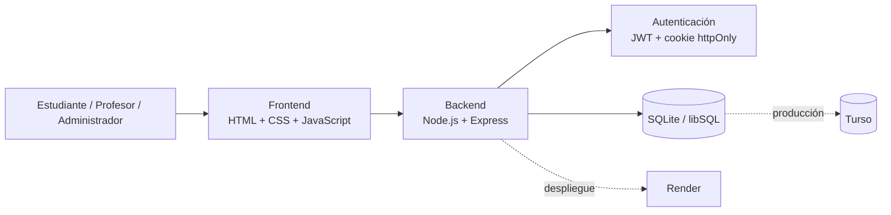
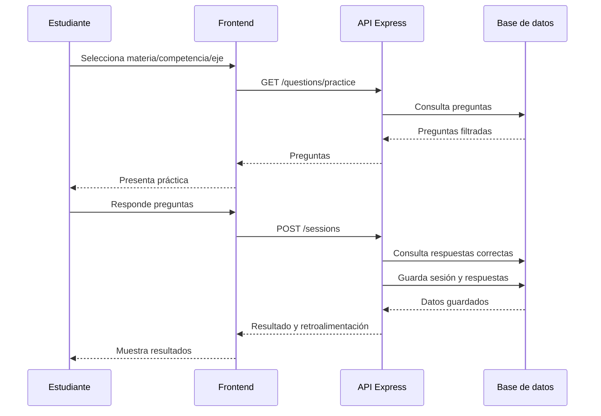

# Adapta 11 — Segundo Informe

## Resumen / Abstract

Adapta 11 es una aplicación web orientada a la preparación para las pruebas Saber 11, inicialmente en las áreas de Lectura Crítica y Matemáticas. El proyecto parte de la necesidad de ofrecer una experiencia de práctica que no se limite a presentar un banco estático de preguntas, sino que permita organizar la práctica según la materia, la competencia, el eje temático y el desempeño registrado del estudiante.

Durante el desarrollo se consolidó un prototipo web funcional con una arquitectura cliente-servidor. El backend está implementado con Node.js y Express, mientras que la persistencia utiliza SQLite/libSQL mediante `@libsql/client`, con conexión a Turso para despliegue. El frontend se implementa como una aplicación de una sola página servida desde el mismo backend, utilizando HTML, CSS y JavaScript. La autenticación utiliza JWT almacenado mediante cookie `httpOnly`, y las contraseñas se almacenan mediante `bcryptjs`.

El avance actual incluye registro e inicio de sesión, gestión de estudiantes, roles de administrador y profesor, asociación de estudiantes a colegios, administración del banco de preguntas, clasificación por materia/competencia/eje/dificultad, textos compartidos para grupos de preguntas, práctica dirigida, simulacros, registro de sesiones y respuestas, retroalimentación por sesión y paneles estadísticos. El banco incluido en `seed.js` contiene 104 preguntas de ejemplo/semilla: 51 de Lectura Crítica y 53 de Matemáticas. La selección adaptativa descrita como objetivo en el primer informe todavía no aparece implementada como mecanismo automático basado en historial; por tanto, queda como una de las actividades principales para el cierre.

La validación realizada sobre el material entregado permite comprobar la coherencia estructural del proyecto y la sintaxis de los archivos JavaScript mediante `node --check`. El repositorio también contiene instrucciones de despliegue para Render y Turso y una ruta `/healthz` para comprobación del servicio.

## 1. Introducción

## 2. Marco conceptual

El proyecto utiliza el concepto de **aprendizaje adaptativo** como referencia para orientar la personalización de la práctica. En el primer informe, este concepto se relacionó con la posibilidad de utilizar información del desempeño para seleccionar preguntas pertinentes. En la implementación actual existe la infraestructura necesaria para almacenar respuestas, aciertos, tiempos, materia, competencia, eje y dificultad, pero la decisión automática de selección basada en ese historial aún no está implementada.

Otro concepto fundamental es el **banco estructurado de preguntas**. Cada pregunta almacenada en la base de datos contiene información de clasificación que permite filtrarla por materia, dificultad, competencia y eje temático. Esta estructura permite que la aplicación no trate todas las preguntas como elementos equivalentes, sino como recursos que pueden recuperarse de acuerdo con diferentes criterios de práctica.

También se utiliza el concepto de **seguimiento del desempeño**. Las tablas `exam_sessions` y `exam_answers` permiten conservar el resultado de las sesiones y el detalle de cada respuesta. Sobre estos datos, el módulo `src/lib/estadisticas.js` calcula indicadores generales, desgloses por materia, competencia y eje, tiempos promedio y evolución sesión a sesión. De esta manera, el proyecto cuenta con una base de datos de desempeño que puede servir posteriormente como entrada para un seleccionador adaptativo.

## 3. Planteamiento del problema

### 3.1 Descripción del problema

El problema identificado consiste en la dificultad de ofrecer una práctica suficientemente pertinente para las necesidades particulares de cada estudiante. Un banco amplio de preguntas no garantiza por sí mismo que el estudiante reciba en cada sesión los ejercicios que más necesita, especialmente cuando existen diferencias entre sus fortalezas, dificultades y preferencias de práctica.

La implementación actual aborda una parte de esta problemática mediante selección dirigida. En el modo de práctica, el estudiante puede escoger la materia y, opcionalmente, una competencia o un eje temático. El backend aplica estos filtros y obtiene preguntas activas de la base de datos, de modo que la sesión se encuentra alineada con la intención explícita del usuario.

Sin embargo, la parte más avanzada del problema, correspondiente a la selección adaptativa automática a partir del historial, todavía no está resuelta en el código entregado. Aunque el sistema registra la información necesaria para realizarla, no se identificó una lógica que tome el historial del estudiante y seleccione automáticamente preguntas según sus debilidades o evolución. Por ello, esta parte permanece como pendiente de implementación y validación.

### 3.2 Restricciones y supuestos de diseño

Una restricción importante es que el sistema trabaja actualmente con las materias de Lectura Crítica y Matemáticas. El esquema de base de datos restringe explícitamente el campo `materia` a estas dos opciones, y el frontend utiliza catálogos específicos de competencias y ejes para cada una. Esto mantiene controlado el alcance del prototipo y evita ampliar la solución a todas las áreas del Saber 11 antes de consolidar el núcleo funcional.

Otra condición de diseño es la dependencia de un banco previamente estructurado. La aplicación puede administrar preguntas y textos, pero la calidad de la experiencia depende de que las preguntas estén correctamente clasificadas y tengan información suficiente para la práctica. El archivo `src/seed.js` permite cargar un conjunto inicial y utiliza una estrategia idempotente para evitar duplicar preguntas existentes cuando se vuelve a ejecutar la semilla.

Finalmente, el despliegue introduce una restricción operativa relacionada con la persistencia. Para desarrollo local se utiliza SQLite mediante un archivo, mientras que para producción el proyecto contempla Turso/libSQL, debido a que el plan gratuito de Render no ofrece disco persistente. Esta separación obliga a configurar variables de entorno apropiadas en el despliegue y a proteger secretos como la clave JWT, el correo y la contraseña del administrador.

### 3.3 Alcance actualizado

El alcance actual incluye una aplicación web funcional para estudiantes, administradores y profesores. Los estudiantes pueden registrarse, iniciar sesión, practicar por materia y filtros temáticos, presentar simulacros y consultar su progreso. Los administradores pueden gestionar preguntas, colegios y profesores, además de consultar información agregada. Los profesores pueden consultar información de los estudiantes asociados a su colegio.

El alcance también se amplió respecto al primer informe con la gestión de textos compartidos. El backend permite crear un texto y asociar varias preguntas a dicho texto, manteniendo las preguntas agrupadas durante la selección. Esto resulta especialmente pertinente para Lectura Crítica, donde varias preguntas pueden depender de un mismo contexto textual.

No forman parte todavía del alcance implementado la generación automática de preguntas mediante modelos de lenguaje, la validación automática de preguntas generadas por inteligencia artificial y la selección adaptativa completamente automatizada. 

## 4. Objetivos

El objetivo general mantiene la orientación definida anteriormente de construir un prototipo de sistema para apoyar la preparación del Saber 11 mediante preguntas estructuradas y mecanismos de práctica diferenciados. El avance actual demuestra que el proyecto pasó de la definición conceptual a una implementación funcional de varios de sus componentes principales.

Los objetivos específicos relacionados con la construcción del banco, la selección dirigida, el seguimiento y la retroalimentación presentan avances concretos. La aplicación dispone de clasificación de preguntas, filtros de práctica, registro de sesiones, estadísticas y revisión detallada de resultados. Además, la administración de preguntas permite mantener y ampliar el banco desde la propia aplicación.

El objetivo relacionado con la selección adaptativa automática continúa parcialmente pendiente. La infraestructura de datos ya permite calcular indicadores de desempeño, pero todavía se requiere implementar la regla o algoritmo que transforme esos indicadores en una selección automática de preguntas. Por tanto, el objetivo general se encuentra avanzado, pero la personalización adaptativa debe ser considerada una prioridad del cierre.

## 5. Estado del arte / soluciones relacionadas

## 6. Solución propuesta

Adapta 11 se implementó como una aplicación web con una interfaz para tres tipos de usuarios: estudiante, administrador y profesor o administrador de colegio. El estudiante constituye el usuario principal de aprendizaje y dispone de las funciones de práctica, simulacro y consulta de progreso. Los otros roles permiten gestionar el contenido y observar información agregada sobre los estudiantes.

El banco de preguntas está respaldado por la tabla `questions`, que incluye materia, dificultad, competencia, eje, enunciado, opciones, respuesta correcta, explicación, imagen y referencia a textos compartidos. El proyecto entregado contiene 104 preguntas en la semilla: 51 de Lectura Crítica y 53 de Matemáticas. La distribución por dificultad es de 29 fáciles, 42 medias y 33 difíciles.

El flujo implementado permite registrar una sesión, guardar cada respuesta y posteriormente generar retroalimentación. El servidor vuelve a consultar la pregunta y determina si la respuesta es correcta a partir de la información almacenada, en lugar de confiar exclusivamente en el navegador. Esta decisión permite mantener consistencia en las estadísticas y constituye una base adecuada para futuras funciones adaptativas.

## 7. Metodología de desarrollo

### 7.1 Enfoque metodológico

El proyecto siguió un enfoque de desarrollo iterativo, coherente con el prototipado propuesto en el primer informe. Las funcionalidades se fueron integrando sobre una base existente y se añadieron módulos conforme aparecieron nuevas necesidades del sistema. El repositorio actual refleja varias iteraciones sobre la estructura de usuarios, preguntas, sesiones, estadísticas y roles.

El desarrollo se apoyó principalmente en la separación entre rutas del backend, lógica auxiliar, middleware y frontend. En el backend existen rutas independientes para autenticación, preguntas, sesiones, administración, colegios y profesores. Esta separación permite modificar una parte del sistema sin concentrar toda la lógica en un único archivo.

La validación realizada durante el desarrollo ha sido principalmente funcional y técnica. Se verificó la sintaxis de los archivos JavaScript del backend y frontend mediante `node --check`, y el repositorio contiene mecanismos de comprobación del servicio mediante `/healthz`. Para el cierre todavía es necesario complementar estas verificaciones con pruebas sistemáticas de casos de uso, integración, usabilidad y comportamiento bajo carga.

### 7.2 Iteraciones o fases de desarrollo

La primera fase se concentró en consolidar el banco y su estructura. El sistema terminó con preguntas clasificadas por materia, dificultad, competencia y eje, además de soporte para textos compartidos. La administración permite consultar, crear, editar y desactivar preguntas, y existe una semilla idempotente para incorporar preguntas sin duplicar las ya existentes.

La segunda fase se concretó principalmente en la práctica dirigida y el simulacro. El modo de práctica permite filtrar por materia y opcionalmente por competencia y eje. El simulacro combina preguntas de las materias seleccionadas y mezcla dificultades, manteniendo la posibilidad de navegar entre preguntas. Estas funciones representan un avance sobre el concepto inicial de seleccionador, aunque no equivalen todavía a la selección adaptativa basada en historial.

La tercera fase incorporó el seguimiento y la retroalimentación. Las sesiones guardan cantidad de preguntas, aciertos, tiempos, materia, dificultad y otros metadatos. El módulo estadístico calcula porcentajes y evolución, mientras que el detalle de una sesión puede identificar preguntas correctas e incorrectas, tiempos y explicaciones. Para el cierre debe completarse la personalización adaptativa y fortalecer la validación con usuarios.

### 7.3 Estrategia de validación

La selección dirigida puede validarse comprobando que los filtros enviados por el estudiante se reflejen en las preguntas recibidas. El endpoint `/api/questions/practice` restringe la consulta por materia y, cuando se proporciona, por competencia y eje. Esto permite realizar pruebas con combinaciones válidas e inválidas y comprobar que las preguntas presentadas correspondan con los filtros solicitados.

La persistencia y corrección de resultados puede validarse mediante sesiones reales de práctica y simulacro. El endpoint de sesiones consulta nuevamente las preguntas almacenadas y calcula los aciertos en el servidor. Posteriormente, `/api/sessions/summary` y `/api/sessions/:id` proporcionan los indicadores y el detalle de retroalimentación que puede compararse manualmente con las respuestas entregadas.

La usabilidad y el rendimiento todavía requieren una validación más formal. En el material entregado no se encuentra una matriz de pruebas con participantes, resultados cuantitativos de satisfacción, pruebas de carga o métricas de latencia.

### 7.4 Plan de trabajo, cronograma e hitos

| Fase | Estado al segundo informe | Resultado |
|---|---|---|
| Banco de preguntas y clasificación | Avanzada | Banco inicial integrado, administración y clasificación implementadas |
| Selección dirigida y simulacro | Implementada | Práctica por materia/competencia/eje y simulacro funcional |
| Perfilamiento y seguimiento | Implementada parcialmente / avanzada | Sesiones, respuestas, estadísticas, evolución y retroalimentación |
| Selección adaptativa | Pendiente | Debe convertir el historial de desempeño en decisiones de selección |
| Validación final | Pendiente | Pruebas de integración, usabilidad, rendimiento y aceptación |
| Cierre | Pendiente | Documentación final, ajustes y entrega del prototipo |

## 8. Requerimientos

### 8.1 Funcionales

El sistema debe permitir registrar e identificar estudiantes, administradores y profesores, aplicando permisos de acuerdo con el rol. Esta funcionalidad está implementada mediante autenticación con JWT y middleware de autorización. Los estudiantes pueden asociarse a un colegio, mientras que los profesores se vinculan a un colegio para consultar sus estudiantes.

El sistema debe permitir gestionar el banco de preguntas. El administrador puede consultar preguntas, filtrarlas por materia, competencia y eje, crear nuevas preguntas, editar preguntas existentes y desactivarlas. También puede administrar textos compartidos y crear grupos de preguntas relacionados con un mismo contexto.

El sistema debe permitir realizar práctica, simulacros y seguimiento. El estudiante puede seleccionar criterios de práctica, responder preguntas y finalizar sesiones. El servidor guarda las respuestas y genera resultados. El estudiante dispone además de una vista de progreso con sesiones, aciertos, desgloses y evolución.

### 8.2 No funcionales

En seguridad, el sistema utiliza contraseñas con `bcryptjs` y autenticación mediante JWT almacenado en cookie `httpOnly`. El acceso a las rutas administrativas y de profesor está protegido por middleware. Las variables sensibles de despliegue se manejan mediante variables de entorno y el repositorio incluye un `.env.example` sin secretos reales.

En mantenibilidad, el backend se divide por responsabilidad entre `routes`, `middleware`, `lib` y `db.js`. La base de datos se inicializa mediante funciones idempotentes y se contemplan migraciones para columnas agregadas posteriormente. El frontend concentra la interfaz en `public/js/app.js`, servido junto con los recursos estáticos desde Express.

En despliegue, el proyecto está preparado para funcionar localmente con SQLite y contempla Turso/libSQL para producción. El archivo `render.yaml` define un servicio web en Render con comandos de instalación, semilla y arranque, además de una ruta de health check. Aún deben medirse de forma experimental atributos como latencia, throughput, capacidad concurrente y disponibilidad real.

## 9. Evaluación de alternativas

### Pregunta: ¿Cuál alternativa ofrece mejor desempeño bajo carga esperada?

La solución actual utiliza Node.js con Express y una base SQLite/libSQL. Para el alcance del prototipo esta alternativa reduce la complejidad y permite que el frontend y el backend se ejecuten como un mismo servicio. Las consultas principales se realizan sobre tablas con índices para preguntas, sesiones y respuestas, lo cual favorece las operaciones habituales del sistema.

No se cuenta todavía con mediciones de latencia promedio, latencia máxima o throughput obtenidas mediante una prueba de carga. Por tanto, no sería correcto presentar una comparación cuantitativa entre SQLite/libSQL y otras alternativas a partir del material disponible. La evaluación de desempeño queda como una actividad de validación para el cierre.

Para completar esta evaluación se propone medir tiempos de respuesta de operaciones críticas como inicio de sesión, carga de preguntas, finalización de sesión y consulta de estadísticas, además de observar el comportamiento con usuarios concurrentes. Los resultados deberán registrarse con una carga definida y condiciones reproducibles.

### Pregunta: ¿Qué grado de acoplamiento introduce cada opción?

La arquitectura actual mantiene el frontend y backend dentro del mismo proyecto y utiliza rutas REST separadas. Esto simplifica la integración, pero también significa que el frontend depende de la estructura de los endpoints del backend. La base de datos se accede mediante un módulo (`src/db.js`), lo que concentra la conexión y facilita cambiar entre SQLite local y Turso.

El acoplamiento con servicios externos se mantiene limitado. La aplicación puede funcionar localmente sin Turso, mientras que Render y Turso se incorporan principalmente para despliegue. Esta característica permite desarrollar y probar el prototipo sin depender permanentemente de infraestructura externa.

Para una evolución posterior se podría separar con mayor claridad las reglas de negocio del acceso a datos y crear interfaces para componentes sustituibles. En el estado actual, sin embargo, la organización por rutas, middleware, biblioteca estadística y módulo de base de datos proporciona una separación suficiente para el tamaño del prototipo.

### Pregunta: ¿Qué nivel de disponibilidad y tolerancia a fallos ofrece cada alternativa?

En desarrollo local la disponibilidad depende del proceso Node.js y del archivo SQLite local. Si el proceso se detiene, la aplicación deja de responder, aunque los datos del archivo permanecen disponibles al reiniciar. Esta modalidad es adecuada para desarrollo, pero no constituye una estrategia de alta disponibilidad.

Para producción se plantea Render junto con Turso. El uso de una base de datos externa evita depender del almacenamiento efímero del servicio web y permite conservar los datos después de reinicios o despliegues. El proyecto también define `/healthz` como endpoint de comprobación de salud del servicio.

No se implementaron mecanismos avanzados de redundancia, recuperación automática o failover dentro del código entregado. Por ello, la tolerancia a fallos debe considerarse preliminar y dependiente de los servicios de infraestructura utilizados. Antes de una entrega productiva sería necesario documentar copias de seguridad, recuperación y manejo de fallos parciales.

## 10. Diseño y arquitectura

La arquitectura actual es de tipo cliente-servidor. El navegador ejecuta la interfaz construida con HTML, CSS y JavaScript, mientras que Node.js con Express sirve los archivos estáticos, expone la API y ejecuta las reglas de acceso a datos. La comunicación entre interfaz y backend se realiza mediante solicitudes HTTP a rutas `/api/*`.

El backend está organizado en módulos. `server.js` configura Express y registra las rutas; `auth.js`, `questions.js`, `sessions.js`, `admin.js`, `colegios.js` y `profesor.js` concentran los endpoints de cada dominio; `middleware/auth.js` controla autenticación y autorización; y `db.js` encapsula la conexión y operaciones principales de persistencia.

La base de datos utiliza SQLite/libSQL y puede conectarse a Turso mediante variables de entorno. Esta arquitectura coincide con la necesidad del prototipo de mantener una solución relativamente sencilla de ejecutar, pero con una ruta de despliegue que permita compartir datos entre usuarios.

### 10.1 Descripción general de la arquitectura
La arquitectura actual es de tipo cliente-servidor. El navegador ejecuta la interfaz construida con HTML, CSS y JavaScript, mientras que Node.js con Express sirve los archivos estáticos, expone la API y ejecuta las reglas de acceso a datos. La comunicación entre interfaz y backend se realiza mediante solicitudes HTTP a rutas `/api/*`.

El backend está organizado en módulos. `server.js` configura Express y registra las rutas; `auth.js`, `questions.js`, `sessions.js`, `admin.js`, `colegios.js` y `profesor.js` concentran los endpoints de cada dominio; `middleware/auth.js` controla autenticación y autorización; y `db.js` encapsula la conexión y operaciones principales de persistencia.

La base de datos utiliza SQLite/libSQL y puede conectarse a Turso mediante variables de entorno. Esta arquitectura coincide con la necesidad del prototipo de mantener una solución relativamente sencilla de ejecutar, pero con una ruta de despliegue que permita compartir datos entre usuarios.

### 10.2 Componentes del sistema

El **frontend** es responsable de presentar formularios, vistas de práctica, simulacro, resultados, progreso y administración. El archivo `public/js/app.js` mantiene el estado de la aplicación y consume la API, mientras que `public/css/styles.css` concentra la presentación visual.

El **backend** procesa autenticación, preguntas, sesiones, estadísticas y administración. Sus rutas validan permisos y consultan la base de datos. El módulo de estadísticas reutiliza consultas para generar indicadores de estudiantes individuales y grupos de estudiantes, evitando duplicar la lógica estadística entre los diferentes roles.

La **base de datos** contiene entidades para colegios, usuarios, textos, preguntas, sesiones y respuestas. Las relaciones entre estas entidades permiten conservar el contexto de una pregunta, registrar quién realiza una sesión y asociar cada respuesta con la pregunta correspondiente. El siguiente diagrama resume la arquitectura:

### 10.3 Interacción entre módulos

El frontend se comunica con el backend mediante la función `api()` definida en `public/js/app.js`. Esta función centraliza las solicitudes, el manejo de errores y el intercambio de datos JSON. Dependiendo de la operación, las solicitudes llegan a autenticación, preguntas, sesiones, administración, colegios o profesor.

Durante una práctica, el frontend solicita un conjunto de preguntas a `/api/questions/practice`, recibe las preguntas y presenta sus opciones al estudiante. Al finalizar, envía las respuestas a `/api/sessions`; el servidor consulta nuevamente las preguntas, calcula los resultados y almacena la sesión y sus respuestas. Posteriormente, el frontend puede consultar `/api/sessions/summary` o una sesión individual.

El flujo puede representarse de la siguiente forma:

### 10.4 Comportamiento

## 11. Implementación y avance actual

### 11.1 Stack tecnológico

### 11.2 Componentes implementados

### 11.3 Integraciones realizadas

### 11.4 Pendientes para la entrega final

## 12. Despliegue y operación preliminar

## 13. Validación preliminar

### 13.1 Pruebas por componentes

### 13.2 Pruebas de integración

### 13.3 Pruebas de usabilidad

## 14. Resultados parciales y discusión

## 15. Plan de cierre hacia la entrega final

## 16. Referencias
